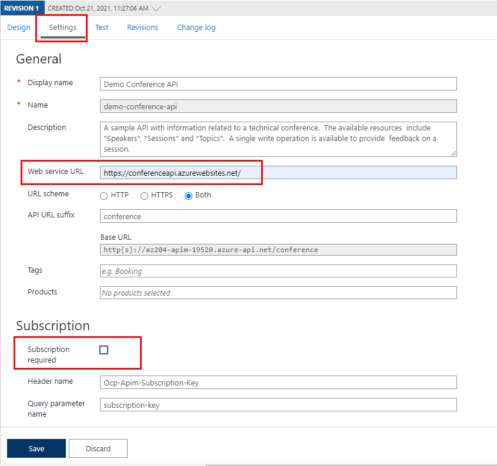

In this exercise you learn how to perform the following actions:

* Create an API Management (APIM) instance
* Import an API
* Configure the backend settings
* Test the API

## Prerequisites

* An **Azure account** with an active subscription. If you don't already have one, you can sign up for a free trial at [https://azure.com/free](https://azure.com/free).

## Sign in to Azure

1. Sign in to the [Azure portal](https://portal.azure.com) and open the Cloud Shell.


1. After the shell opens be sure to select the **Bash** environment.


## Create an API Management instance

1. Let's set some variables for the CLI commands to use to reduce the amount of retyping. Replace `<myLocation>` with a region that makes sense for you. The APIM name needs to be a globally unique name, and the following script generates a random string. Replace `<myEmail>` with an email address you can access.

    ```bash
    myApiName=az204-apim-$RANDOM
    myLocation=<myLocation>
    myEmail=<myEmail>
    ```

 1. Create a resource group. The following commands create a resource group named *az204-apim-rg*.

    ```bash
    az group create --name az204-apim-rg --location $myLocation
    ```

1. Create an APIM instance. The `az apim create` command is used to create the instance. The `--sku-name Consumption` option is used to speed up the process for the walkthrough. 

    ```bash
    az apim create -n $myApiName \
        --location $myLocation \
        --publisher-email $myEmail  \
        --resource-group az204-apim-rg \
        --publisher-name AZ204-APIM-Exercise \
        --sku-name Consumption 
    ```
    > [!NOTE]
    > The operation should complete in about five minutes. 

## Import a backend API

This section shows how to import and publish an OpenAPI specification backend API.

1. In the Azure portal, search for and select **API Management services**.

1. On the **API Management** screen, select the API Management instance you created.

1. Select **APIs** in the **API management service** navigation pane.


1. Select **OpenAPI** from the list and select **Full** in the pop-up.


    Use the values from the table below to fill out the form. You can leave any fields not mentioned their default value.

    | Setting | Value | Description |
    |--|--|--|
    | **OpenAPI Specification** | `https://conferenceapi.azurewebsites.net?format=json` | References the service implementing the API, requests are forwarded to this address. Most of the necessary information in the form is automatically populated after you enter this. |
    | **Display name** | *Demo Conference API* | This name is displayed in the Developer portal. |
    | **Name** | *demo-conference-api* | Provides a unique name for the API. |
    | **Description** | Automatically populated | Provide an optional description of the API. |
    | **API URL suffix** | *conference* | The suffix is appended to the base URL for the API management service. API Management distinguishes APIs by their suffix and therefore the suffix must be unique for every API for a given publisher. |
    

1. Select **Create**.

## Configure the backend settings

The *Demo Conference API* is created and a backend needs to be specified. 

1. Select **Settings** in the blade to the right and enter `https://conferenceapi.azurewebsites.net/` in the **Web service URL** field.

1. Deselect the **Subscription required** checkbox.



1. Select **Save**.

## Test the API

Now that the API has been imported and the backend configured it's time to test the API.

1. Select **Test**.


1. Select **GetSpeakers**. The page shows **Query parameters** and **Headers**, if any. The `Ocp-Apim-Subscription-Key` is filled in automatically for the subscription key associated with this API.

1. Select **Send**.

    Backend responds with **200 OK** and some data.

## Clean up Azure resources

When you're finished with the resources you created in this exercise you can use the command below to delete the resource group and all related resources.

```bash
az group delete --name az204-apim-rg
```
